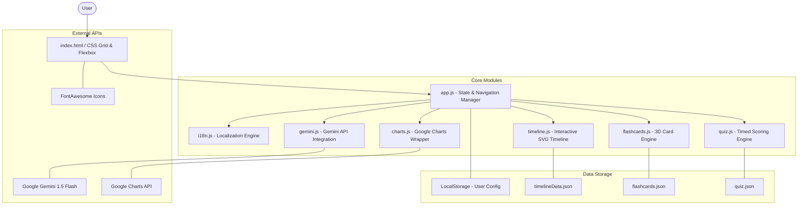
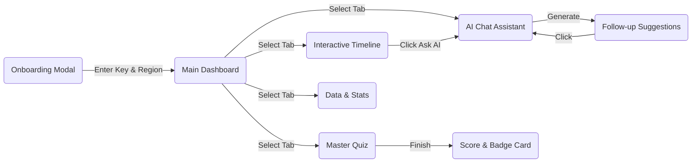
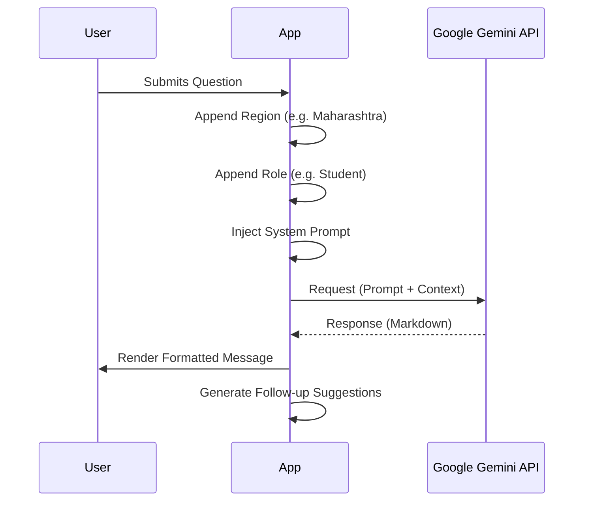

# DemocraSee - Interactive Election Guide

> **"Your Smart Election Guide for Every Indian Citizen"**

DemocraSee is a high-performance, interactive web application designed to simplify and gamify civic education for Indian citizens. It leverages the Google Gemini API to provide personalized AI assistance while offering a suite of interactive modules—from a 10-phase election timeline to spaced-repetition flashcards and a timed master quiz.

## 🌟 Key Features

- **🤖 AI Election Assistant:** Powered by Google Gemini API, providing personalized, region-specific, and role-based civic education with integrated Web Speech API for voice-to-text input.
- **🌐 Multilingual Support:** Real-time UI translation for English, Hindi, Tamil, and Bengali.
- **📅 Interactive Timeline:** A vertical, glowing guide to the 10 core phases of the Indian election process with direct AI integration.
- **🃏 Spaced Repetition Flashcards:** Learn 25 essential civic terms with 3D flip animations and mastery tracking.
- **📊 Data Visualization:** Interactive charts built with Google Charts API showcasing seat distribution, turnout trends, and gender parity.
- **🧠 Master Election Quiz:** A timed, scored challenge with performance badges and sharing capabilities.
- **✅ Eligibility Checker:** A 3-step interactive wizard to verify voting requirements and access official registration portals.

## 🏗️ Application Architecture



### 🛣️ User Journey Flow



### 📡 AI Interaction Flow (Data Context)



## 🛠️ Technology Stack

- **Frontend:** HTML5, CSS3 (Vanilla), JavaScript (ES Modules)
- **Design System:** Custom CSS properties, Inter & Poppins fonts, FontAwesome icons
- **Data Visualization:** Google Charts (`loader.js`)
- **AI Integration:** Google Gemini API (REST Implementation)
- **Server:** Node.js + Express (serving static assets for Cloud Run)
- **Deployment:** Google Cloud Run

## 🚀 Setup & Installation

To run DemocraSee locally:

1. **Clone the repository:**
   ```bash
   git clone <repository-url>
   cd democrasee
   ```

2. **Configure the AI API:**
   - Get an API key from [Google AI Studio](https://aistudio.google.com/).
   - Create a `public/config.js` file:
     ```javascript
     export const CONFIG = { GEMINI_API_KEY: "YOUR_API_KEY_HERE" };
     ```

3. **Run a local server:**
   ```bash
   npm install
   npm start
   ```

4. **Open the app:**
   Navigate to `http://localhost:8080` in your web browser.

## 📝 Performance & Security

- **Modular Design:** Each feature is encapsulated in a separate ES module, ensuring easy maintainability and low bundle sizes.
- **Zero Build Step:** Built purely with vanilla web standards, avoiding the complexity of bundlers for rapid deployment.
- **Edge Deployment:** Deployed to Google Cloud Run for high availability and low latency across regions.

## 📄 License

This project is licensed under the MIT License.
